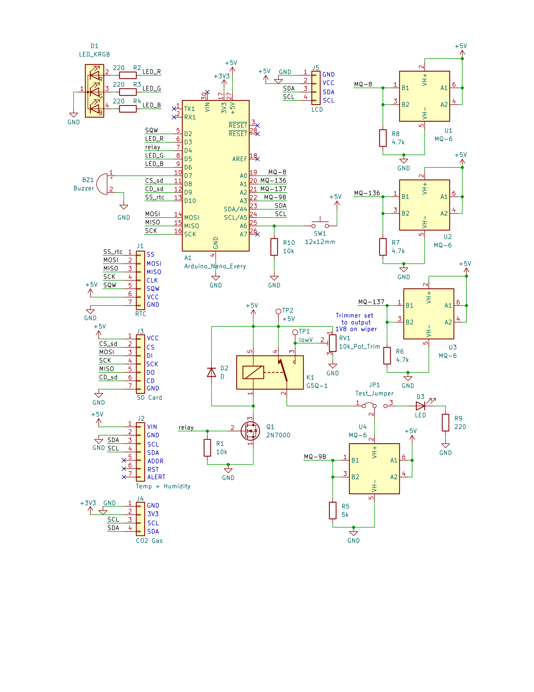

# EnvSafetyLogger

An environmental monitoring system for industrial safety, featuring multi-gas sensors, temperature, humidity, data logging, and alerts.

This project involves designing an environmental safety monitor to measure and log air quality parameters. The monitor is housed in a custom 3D-printed enclosure and is built using a variety of sensors to measure gases and environmental conditions.

## Future Work

Future work includes:

- Weather-resistant enclosure (standard ingress protection)
- Wireless connectivity to enable data transmission and remote monitoring
- Improved calibration and integration of MQ sensors
  - See [CameronBrooks11/MQ-xx](https://github.com/CameronBrooks11/MQ-xx) for initial work involving extraction of regression parameters from component datasheets
- PCB design
- Variation for measuring closed systems with directed sampling
- Use Wet Bulb Globe Temperature (WBGT) as measure of heat stress conditions
  - WBGT is a measure of how hot it feels in direct sunlight, taking into account temperature, humidity, wind, and sun

## Results

### Schematic

The schematic shows the full circuit layout, including the Arduino Nano Every as the main controller, the various sensors, GUI components, and supporting circuitry. The schematic can be found in the `hardware` folder and is designed using KiCad.

### Firmware and Hardware

The firmware for the EnvSafetyLogger is written in `.ino` format with configuration files in `.h` format, located in the `firmware` folder.

### 3D-Printed Enclosure

The enclosure was printed in PETG with a 0.8mm nozzle on a Prusa MK3S+, optimized to print without supports. The source file for the CAD design can be found [here on Onshape](https://cad.onshape.com/documents/19c4dfddea3c27460450ef2e/w/2ec8d1afb4664a197accd547/e/7aca4c51ab1e6bf835721462).

#### Fully Assembled Front View

#### Empty Enclosure

### Sensor and Component Placement

This board includes the SCD41 for temperature, humidity, and carbon dioxide (CO₂); the ENS160 air quality sensor (AQI, TVOCs, eCO₂); various MQ-series gas sensors (MQ-8 for H₂, MQ-136 for H₂S, MQ-137 for NH₃, and MG-9B for CO and CH₄); and additional circuitry for driving the MQ sensor heaters, triggering audio-visual alarms, logging timestamped data, and displaying information. The board is constructed to be modular and serviceable while still being mechanically rigid and reliable, using headers and standoffs for all components.

#### Sensor Components Mounted

#### GUI and Control Panel Mounted

### Soldered Boards

Two views of the soldered board showing component placement and wiring.

#### Soldered Front View

### Calibration and Testing

Testing and tuning were performed to ensure accurate sensor readings. The MQ9B sensor, which detects CO and CH₄, requires a bi-voltage heater cycling to operate correctly, switching between low and high voltages to improve sensitivity and response time. A trimmer pot on the board is tuned to set the relay's NO (normally open) output to 1.5V, which is used to control the heater cycle. Headers are provided to facilitate testing and allow for disconnecting the line to the MQ9B heater pin. This setup enables switching to an LED for testing without affecting the MQ9B sensor, making it easier to validate heater operation independently.

Future work will focus on establishing standard calibration procedures, including regression curve fitting of the sensor's analog signal to match the expected ppm range, and compensating this fitted curve for environmental factors such as temperature and humidity to improve accuracy.

#### Voltage Tuning

### Installed in Environment

Once assembled, the monitor was installed and tested in a mobile photovoltaic (PV) box used for electrolysis experiments on wastewater.

### License

This project is licensed under the GNU General Public License v3.0 (GPL-3.0). See the `LICENSE` file for details.
